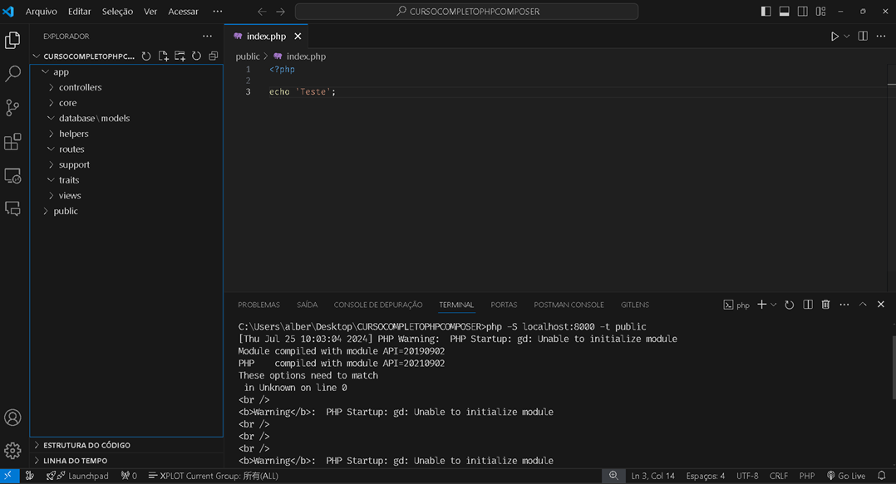

### ESTRUTURA DO PROJETO

app-|
    |-controllers
    |-core
    |-controllers
    |-database|
              |-models
    |-helpers
    |-routes
    |-support
    |-traits
    |-views
public-|
       |-css
       |-js
       -- index.php

composer.json ( >composer init )

### COMANDOS
composer init -> src (n) -> criar manualmente

composer.json

{
    "name": "alber/cursocompletophpcomposer",
    "authors": [
        {
            "name": "Alberto Gomes da Silva",
            "email": "albertogomesdasilva@gmail.com"
        }
    ],
    "require": {},
    "autoload": {
        "psr-4": {
            "app\\":"app"
        },
        "files": [
        ]
    }
}

# composer du (dumpautoload) -> para criar a pasta vendor

php -S localhost:8000 -t public"# phpprofissional" 
